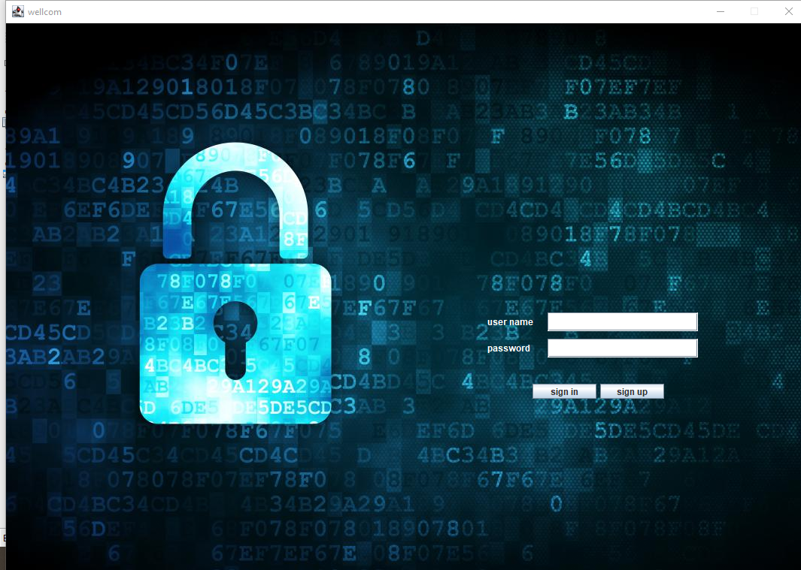

# University Management System

A Java desktop application for managing university students and their grades.

## Features

- User authentication system (Sign In / Sign Up)
- Add new students
- Update student information
- Add student degrees
- Update student degrees
- Print degrees table
- Simple and user-friendly interface

## Technologies Used

- Java
- Java Swing
- NetBeans
- SQLite Database

## Screenshots

### Login Screen

### Sign Up Screen

### Student Management

### Degree Management

### Update Student

### Update Degree

### Print Degrees

## Author

Saeed ElSabagh
